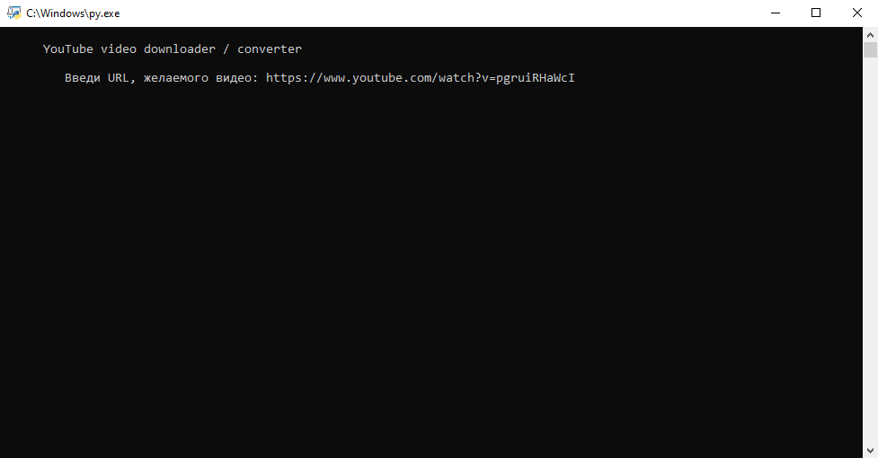
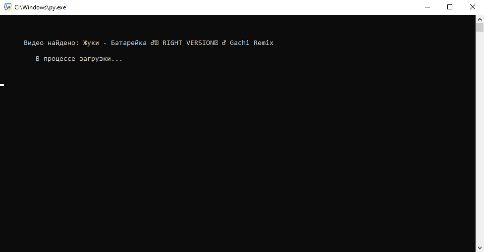
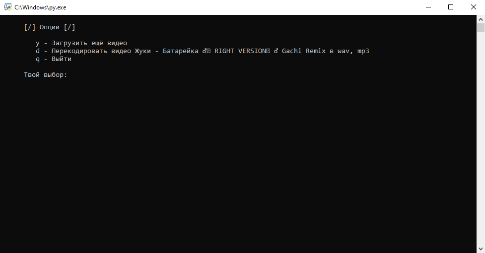
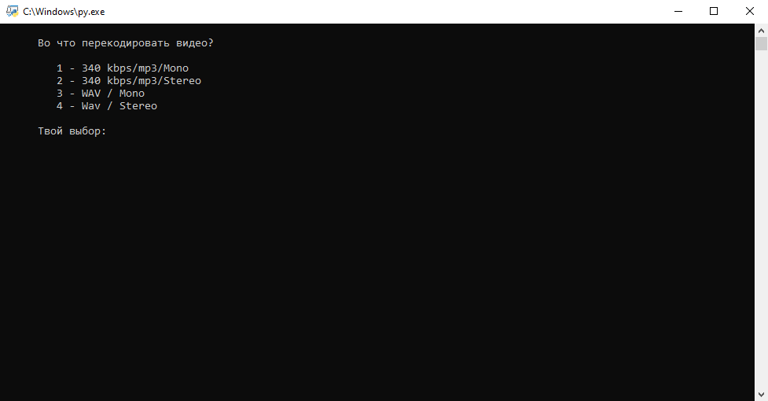

# YT_Downloader_Converter

YouTube video downloader / converter

## Requirements

```
Python 3
windows terminal
pip install youtube_dl
```

## About

Простой скрипт для загрузки видео с YouTube, а также дальнейшей конвертации его в форматы wav, mp3 (stereo / mono) используя библиотеку ffmpeg, библиотека уже включена в данный репозиторий.\
Т.к. я занимаюсь музыкой и в поисках сэмплов мне приходится иногда выкачивать видео с YouTube, а также конвертировать видео в wav было решено написать удобный скрипт.\
Наверное вас тоже бесит эта ситуация, когда для скачивания видео вам приходится прибегать к сторонним сайтам и программам.

## Screenshots




